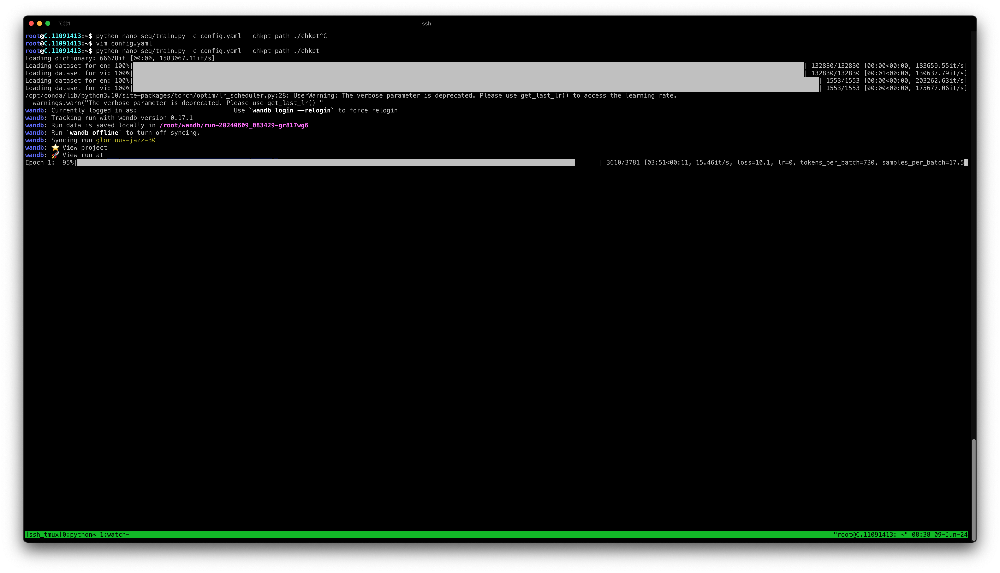
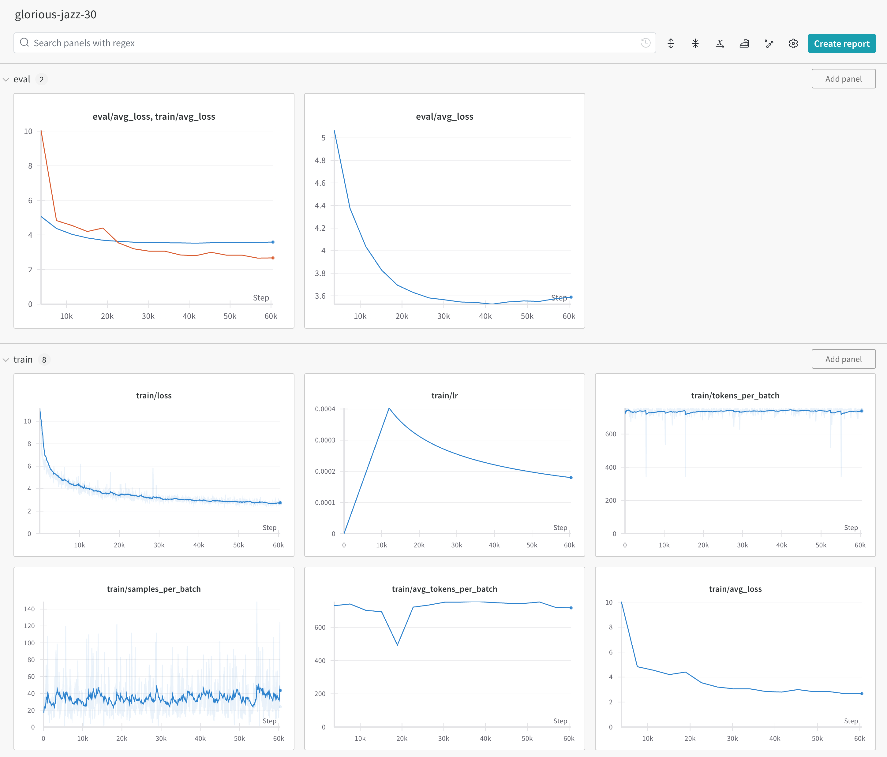

# nano-seq: a pytorch nmt library implemented from scratch

## Introduction

This repository serves as my reference implement of the Transformer architecture, and supplementary things to make up a fully working neural machine translation model.

The structure of this repository is inspired by [fairseq](https://github.com/facebookresearch/fairseq), which I had an opportunity working with while playing around with experimental NMT architectures for my undergraduate thesis. Reimplementing the NMT model from scratch is an excellent way to know more about the intricacies of implementation details, that cannot be fully understood just by reading the paper alone.

**Quick project navigation:**
- [Transformer implementation](nano_seq/module/transformer.py)
- [Translation-related logics](nano_seq/task/translation.py)
- [Data collating](nano_seq/data/collator.py)
- [Decoding (greedy search, beam search)](nano_seq/utils/search.py)

The project currently supports logging training details to Weight and Biases. One can implement a log sink for Tensorboard by extending [utils.logger.LoggingHandler](nano_seq/utils/logger.py).

**To be implemented:**

- [ ] Beam search
- [ ] Autoregressive hidden state caching

## Quick guide

### Config file

The specifications of the transformer model is defined in a config file. A reference [config.yaml](config.yaml) is included. The parameter names are quite self-explainatory.

**Gotchas:**

- Batch size is calculated in **tokens/batch**, not samples/batch. Before training, batches are constructed by sorting the data by increasing source length, and samples are greedily grouped until the total number of tokens in the batch exceeds specified size (see [BaseCollator](nano_seq/data/collator.py)). Data is not sorted during inference.

### Dataset and dictionary

A nano-seq **parallel dataset** is basically a directory with two `txt` files with the filenames being language codes. Source and target language is specified in the training config.

For example:
```
data
├── test
│   ├── en.txt
│   └── vi.txt
├── train
│   ├── en.txt
│   └── vi.txt
└── valid
    ├── en.txt
    └── vi.txt
```

A **dictionary** is the vocab file exported from `spm_train`, in which each line is the token entry and its frequency, seperated by a tab character. The frequency information is not used by nano-seq, so you are free to use any subword tokenizer, as long as the dictionary is converted to the described format (e.g. by setting a dummy frequency -1 for all entries).

If you wish to use two separated vocabularies for each language (e.g. to disable embedding sharing between the encoder and decoder), set the config `shared_dict` to `false`, and include two files in the dictionary folder.

```
data
├── dictionary
    ├── en.vocab
    └── vi.vocab
```

In case a shared dictionary is used, it should be named `dictionary.vocab`.

### Installation

```bash
git clone https://github.com/hungngocphat01/nano-seq
pip install ./nano-seq
```

### Training

```bash
python train.py \
  -c path/to/config.yaml \
  --chkpt-path path/to/checkpoint/dir \
  --chkpt-load /path/to/checkpoint_to_load.pt
```

The last parameter can be omitted if training from the beginning.

### Inference

```bash
python predict.py \
  -c path/to/config.yaml \
  --data-path path/to/inference/dataset \
  --dict-path path/to/dictionary/dir \
  --batch-size 256 \
  -o output_file.txt
```

When calling the inference script, the `valid_path`, `dict_path` and `batch_size` in the config file are ignored, and has to be explicitly redefined.

### Reference

A reference IWSLT'14 English-Vietnamese dataset (tokenized and truncated) is included in the `Release` section of GitHub, using the `subword-nmt` tokenizer.

# Screenshots

Training CLI




