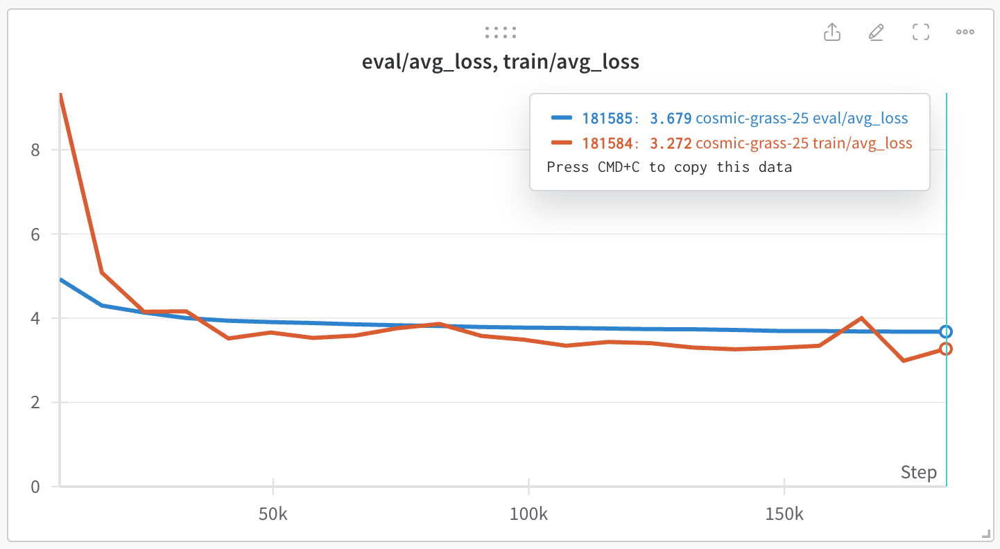

A minimal text sequence modeling library. Aims to create a neural machine translation model from scratch.  
Currently has a working Transformer implementation.

- [x] Transformer implementation
- [x] Raw text data loading/collating logic
- [x] Proxy task to evaluate the implementation (sentence classification)
- [x] Common logic between different tasks (training loop, config management, etc.)
- [x] NMT
  - [x] Parallel (bilingual) dataset implementation
  - [x] Greedy decoding
  - [ ] Beam search
- [ ] NMT++
  - [ ] Memory optimization (lazy-loading dataset)
  - [ ] KV caching

## Experiment reproducing

- Task: IWSLT'14 English-Vietnamese
- BLEU: 20.7 (greedy search)

Details TBA, when beam search implementation is complete.
